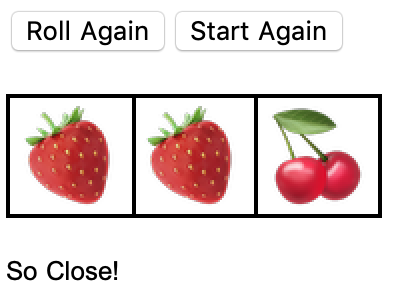

## Introduction

In this project, you are going to build an interactive fruit machine game. The game is simple: you press a button and three fruits are randomly selected from five possible options. If you get three of the same fruit, you win the game!

### What you will make

--- collapse ---
---
title: What you will need
---
### Hardware

+ A computer (desktop, laptop, or Raspberry Pi)

### Software

+ Wolfram Language, available for free on the Raspberry Pi as part of the official operating system, Raspbian

--- /collapse ---

--- collapse ---
---
title: What you will learn
---

+ How to choose items randomly from a list
+ How to add buttons
+ How to respond to user choices

--- /collapse ---

--- collapse ---
---
title: Additional information for educators
---

If you need to print this project, please use the [printer-friendly version](https://projects.raspberrypi.org/en/projects/c3-wolfram-fruit-machine/print){:target="_blank"}.

--- /collapse ---
