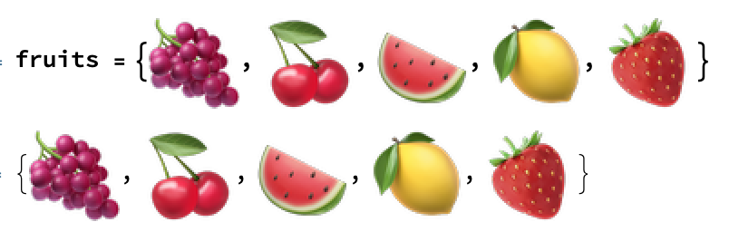

## Importing Images

The first step is to find pictures of fruits and get them into your notebook so you can use them in your project.

--- task ---

Copy and Paste, or drag and drop these images into your notebook, and put them into a list.

Lists start with `{` and end with `}`, and each item is separated by a `,`.
Assign this list to the variable name `fruits`.

--- /task ---