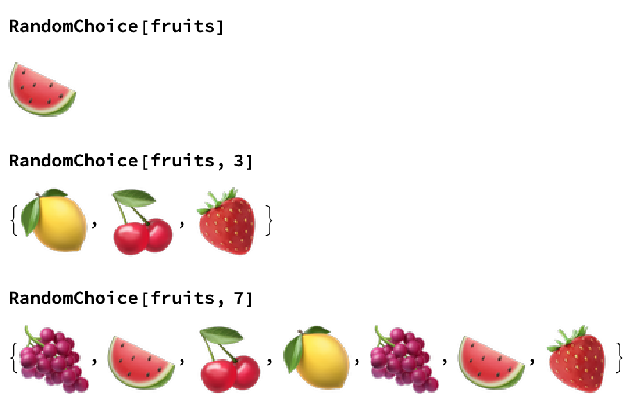
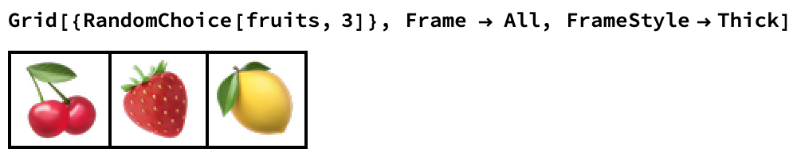

## Random choices

The game requires three random fruits from the list.

In order to choose fruits at random, you use the `RandomChoice` function. 

```
RandomChoice[fruits]
```

`RandomChoice` takes two arguments:
1. The list of options to choose from.
1. The number of items to randomly choose from the list.

By default, `RandomChoice` returns one item.



--- task ---

Use `RandomChoice` to create a list of three random fruits taken from the `fruits` list.

```
RandomChoice[fruits, 3]
```
--- /task ---

At the moment, running the program shows lots of bits of code, like `{}` and `,`. That doesn't look very nice, so make the output look better.

--- task ---
You can present the chosen fruits much like a real fruit machine would do.

To do this, put the output into a `Grid` with a `Frame`.

```
Grid[{RandomChoice[fruits, 3]}, Frame -> All, FrameStyle -> Thick]
```



--- /task ---
