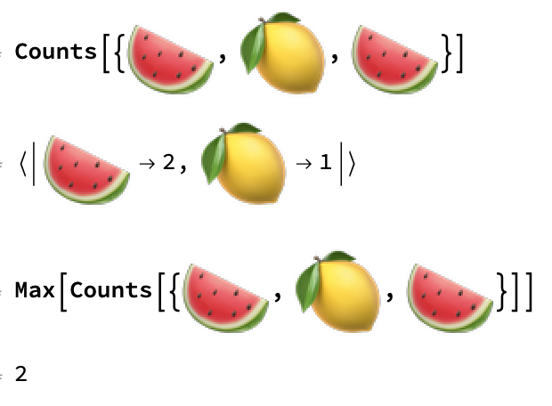
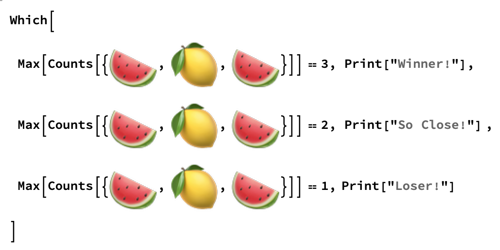

## Build a game

There are three possible outcomes in a fruit machine game:
+ Three fruit of the same kind, which is a win
+ Two fruit of the same kind, which is close but not quite a win
+ All fruits are different, which is a loss

Each time the game runs, you need to find out how many of the randomly selected fruits are the same. You can do this by first using `Count` to find the number of each possible fruit. Then you can use `Max` to find out the largest number.



This gives you a set of rules to build your game:

+ If `Max` is 3, the game is won and should print the message 'Winner!'
+ If `Max` is 2, then the game should print the message 'So Close!'
+ If `Max` is 1, the game is lost and should print the message 'Loser!'

The best tool to use here is a `Which` statement. `Which` checks multiple conditions for whether they are `True`, and returns a specific output depending on which is the `True` condition. If the first condition is `True`, `Which` returns the output for that condition. If the second conditionis `True`, `Which` returns the output for that condition, and so on, until `Which` has checked all conditions.

In your game, `Which` can take the list of randomly chosen fruits as input and use the three rules as conditions.



--- task ---
First, tidy up your program: delete the code that includes `RandomChoice[fruits, 3]`.
--- /task ---

--- task ---
Create a `Which` statement that combines the random fruit picker and the game rules.

```
roll = RandomChoice[fruits, 3]
Which[
 Max[Counts[roll]] == 3, Print["Winner!"],
 Max[Counts[roll]] == 2, Print["So Close!"],
 Max[Counts[roll]] == 1, Print["Loser!"]]
```
--- /task ---
