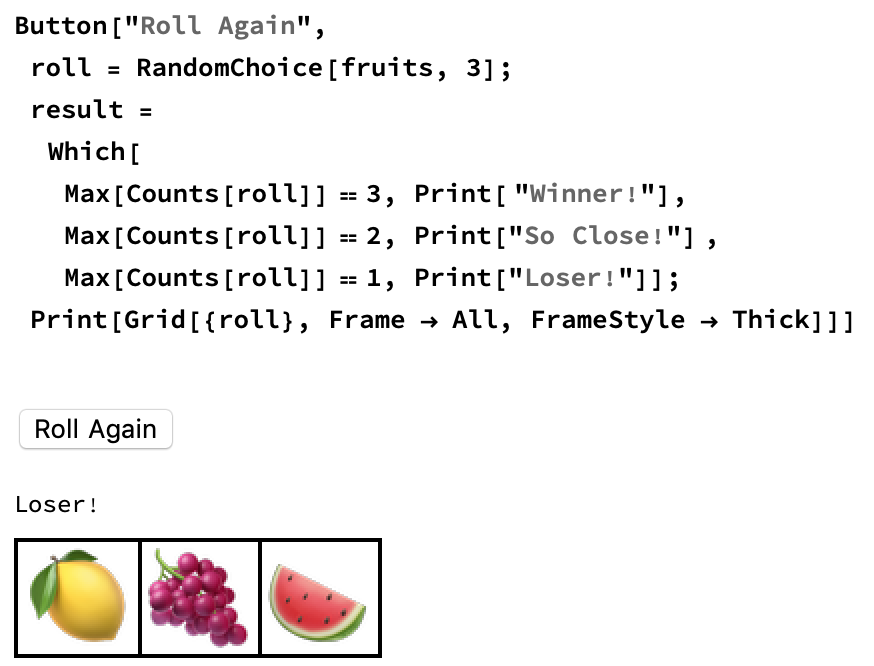

## Make your game playable

The game isn't very interactive yet. And you still have to run two functions in order to get the fruit and the message. It would be better if the game had a button that you can click to make the game show the fruit selection and the message.

So you need a button that selects three random pieces of fruit, and that runs the `Which` function to display a message.

--- task ---

Put your `Which` statement and your `roll` variable into a `Button` function.

Use a `;` to separate commands inside the `Button`.



--- /task ---

Notice that every time you press the button, the new output appears below the old output. It would be better to instead replace the old output with the new output.

You can do this by using `Dynamic`. `Dynamic` displays the up-to-date value of a variable. So each time you click the button to run the code, `Dynamic` updates to the new value.

--- task ---
Use `Dynamic` to display the fruit selection and the message. 

```
roll = RandomChoice[fruits, 3];
result = Text["Click Roll Again to Start"];
Button["Roll Again",
 roll = RandomChoice[fruits, 3];
 result =
  Which[
   Max[Counts[roll]] == 3, Text[ "Winner!"],
   Max[Counts[roll]] == 2, Text["So Close!"] ,
   Max[Counts[roll]] == 1, Text["Loser!"]]]
Dynamic[Grid[{roll}, Frame -> All, FrameStyle -> Thick]]
Dynamic[result]
```
--- /task ---

--- task ---
If you haven't done so already, remove the code for the non-`Dynamic` button.
--- /task ---
