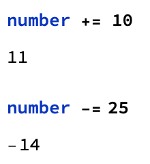

## Keep score

Great, now you have a button you can click to automatically get a new selection and the right message. But you probably want to keep score of how well your game is going. To keep score, you need a variable for the score. Each result in the `Which` statement should add or subtract from the score.

In order to add or subtract from a number, you first set the number as a variable:
```
number = 1
```
Then you can add using `+=`, and subtract using `-=`.



--- task ---
Create a `score` variable. Put `score` below your `roll` and `result` variables.

```
score = 100;
``` 
--- /task ---

Within the `Which` function, you can use `;` to make multiple things happen if a condition is true. This is called a **Compound Expression**. So for each condition, you can change the score.

  + Winning (when the `Max` is 3) should increase the score by 10 points.
  + Losing (when the `Max` is 1) should decrease the score by 10 points.
  + Getting close (when the `Max` is 2) should make no difference to the score.

These are just suggestions. If you like, you can make your game assign other numbers of points for the results.

--- task ---

Decide how many points you gain or lose for each result (winning, getting close, or losing).

Add the score changes to your `Which` statement using a `;`.

```
result =
  Which[
   Max[Counts[roll]] == 3, score += 10; Text["Winner!"],
   Max[Counts[roll]] == 2, Text["So Close!"],
   Max[Counts[roll]] == 1, score -= 10; Text["Loser!"]]
```
Replace the code you already have for `result` with your new `Which` statement.

--- /task ---

You also need a way to reset the score at the beginning of each game.

--- task ---
Create another button that sets the score to 100.

Put the new button on a new line after the `"Roll Again"` button.


```
Button["Start Again", score = 100]
```

 --- /task ---
Of course, you also want to display your score. This is easy, because you can use `Dynamic` again, as you do for `roll` and `result`.

---task---
Make the score display dynamically at the end of your output.

--- hints ---
--- hint ---
`Dynamic` needs a variable as an argument.
--- /hint ---
--- hint ---
Look at the code you have for `roll` and `result` to see how they're displayed dynamically.
--- /hint ---
--- hint ---
Put this code on a new line at the end of your program:

```
Dynamic[score]
```
--- /hint ---
--- /hints ---
---/task---
